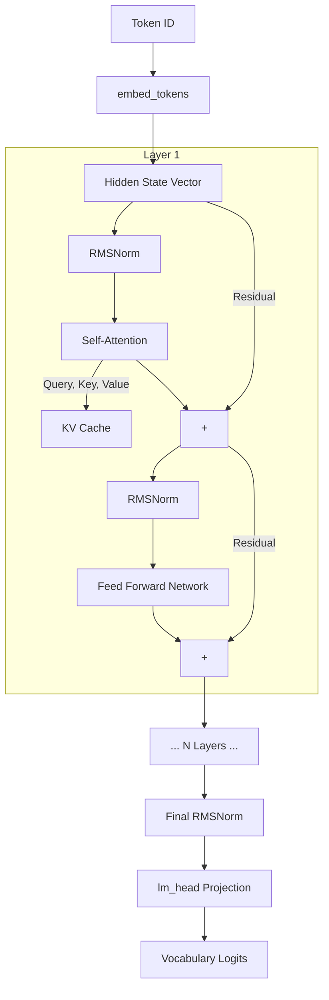
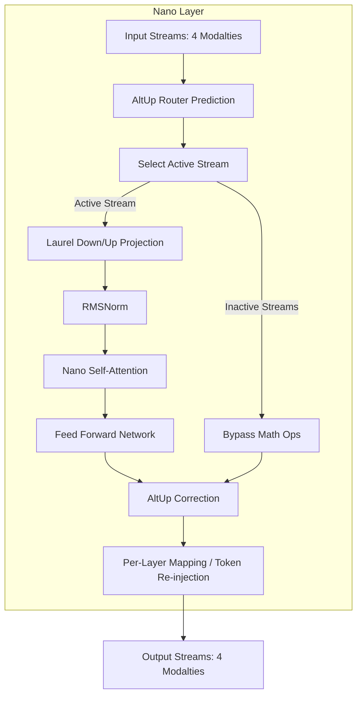
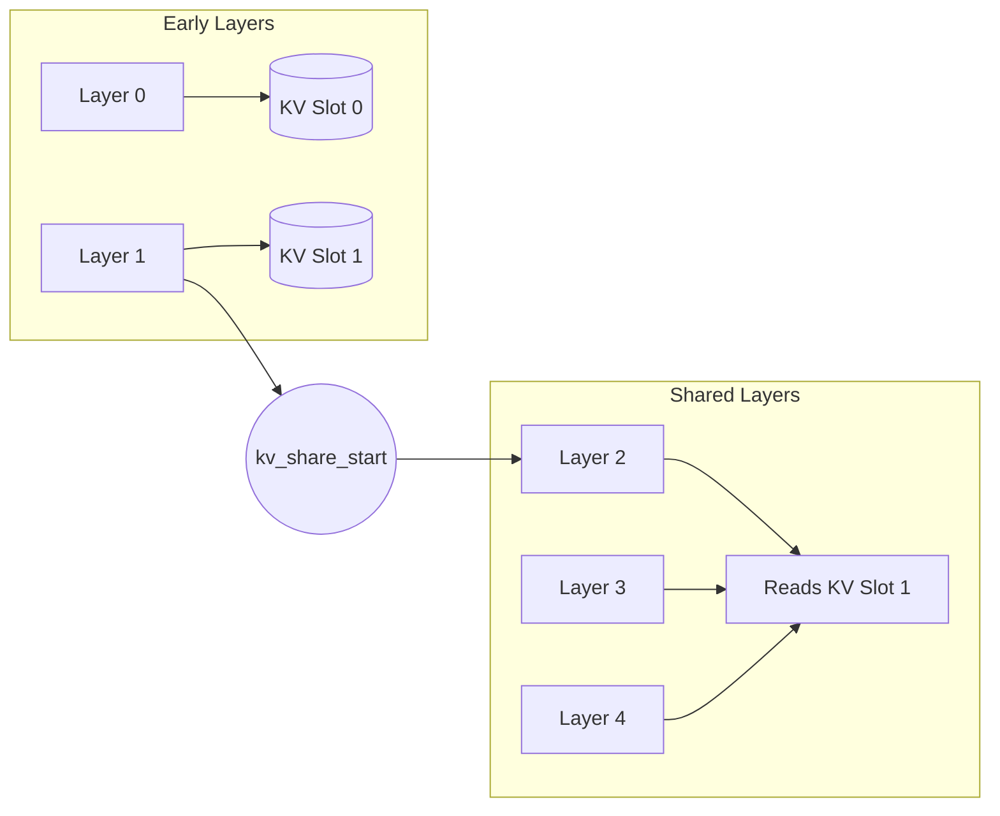

# Architecture Diagrams

The following Mermaid diagrams illustrate the flow of data through the mogemma inference engine.

## Standard Gemma 3 Forward Pass

This diagram shows the lifecycle of a single token as it passes through the standard Gemma 3 model.

## Nano Architecture (AltUp Data Flow)

This diagram highlights the complex, multi-stream data flow inside a single Nano layer.

## KV Cache Sharing Boundary (Nano)

This diagram visualizes how the Nano architecture shares KV cache to save memory.

